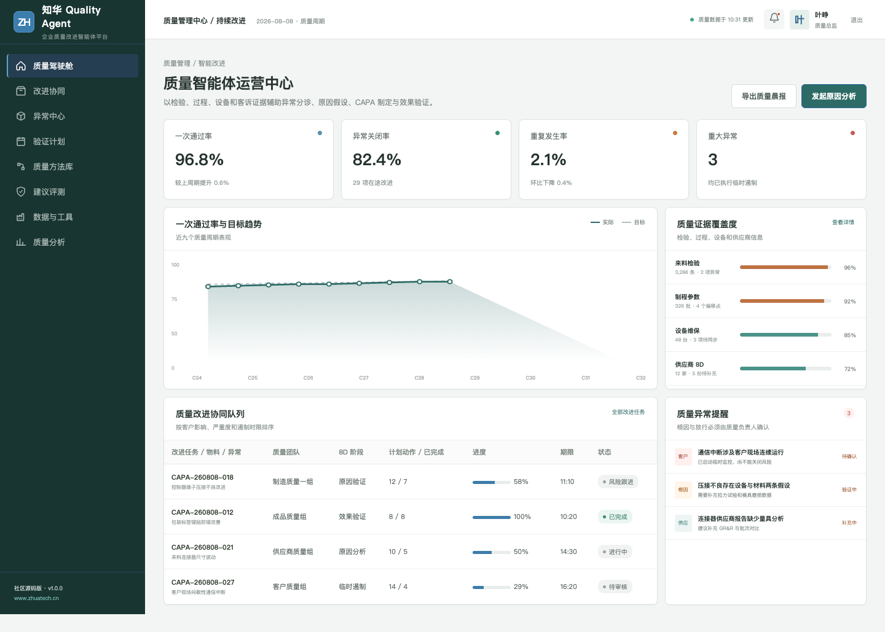
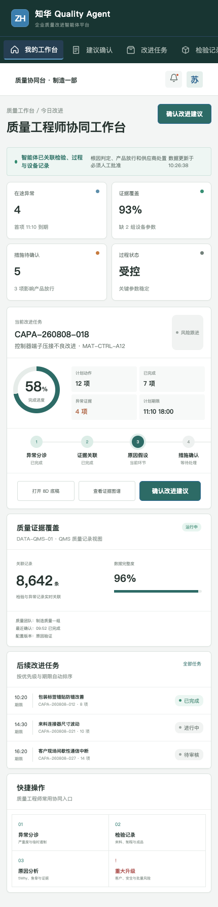

# QualityAgent · 知华科技质量改进智能体

> 从异常现象出发，沿着证据形成可验证的原因假设。
>
> [知华科技（上海如静知华信息科技有限公司）官网](https://www.zhuatech.cn/) · 企业 AI 转型、Agent 定制、私有化部署与软件项目外包

面向质量工程师、供应商质量、制造质量与客户质量团队的 AI Agent 社区源码项目，覆盖异常分诊、证据关联、原因假设、CAPA、8D 和效果验证。

## 一条完整的质量证据链

**异常分诊 → 临时遏制 → 证据关联 → 原因假设 → 验证实验 → CAPA → 效果确认。**

系统同时保留失败假设和人工修订，避免把模型生成内容直接当作根因。

## 产品界面

质量智能体运营中心提供跨团队任务、风险、建议评测和数据工具的运营视角。

质量工程师协同工作台面向一线业务角色，保留证据、建议、人工确认和结果回写的完整链路。

## 主要能力

- 来料、制程、成品与客诉异常分诊
- 检验、MES、设备和供应商证据关联
- 5Why、鱼骨和可验证原因假设
- 临时遏制与 CAPA 行动协同
- 措施有效性与重复发生跟踪
- 根因、关闭与产品放行人工批准

## 工程实现

| 层次 | 技术与职责 |
| --- | --- |
| H5 / Web | Vue 3、Pinia、Vue Router、Axios、Vite，响应式适配桌面与移动端 |
| Java API | Java 21、Spring Boot、Spring Security、JWT、JPA、Bean Validation |
| Agent 边界 | AgentRuntime 可替换，默认只运行本地演示，不调用真实模型或业务系统 |
| 领域策略 | RootCauseService 提供可测试、可解释的业务安全规则 |
| 数据 | MySQL 8、Flyway；测试环境使用 H2 |
| 交付 | Docker Compose、Nginx、CI、API、架构、数据库和部署文档 |

依据严重度、重复发生、证据数量和客户影响形成紧迫度与多条根因假设，不会自动关闭 CAPA 或批准放行。

## 本地体验

仅查看演示界面：

~~~bash
cd frontend
npm install
npm run dev:demo
~~~

访问 http://localhost:5173。管理端使用 **planner / Demo@2026**，业务协同端使用 **operator / Demo@2026**。

完整部署参数见 [deploy/README.md](deploy/README.md)，接口见 [docs/api.md](docs/api.md)，架构边界见 [docs/architecture.md](docs/architecture.md)。

## 使用许可与商业授权

本工程采用知华科技社区源码许可，**仅限个人学习、研究和非商业技术交流，不得商用**。企业内部使用、生产部署、项目交付、SaaS、收费服务、二次销售、品牌替换或其他商业用途，必须事先取得上海如静知华信息科技有限公司书面授权。完整条款以 [LICENSE](LICENSE) 为准。

深度定制、私有化部署、商业授权、AI Agent 咨询和软件项目外包，可访问[知华科技官网](https://www.zhuatech.cn/)或扫码咨询。

| 商务与技术咨询 | 项目合作咨询 |
| --- | --- |
|  |  |

SEO 关键词：Quality Agent,质量智能体,CAPA AI,8D Agent,根因分析 AI,Java Vue QMS，知华科技，上海如静知华信息科技有限公司。

## 企业级 CAPA 建议发布

新增 `POST /api/enterprise/qualityagent/capa-recommendation-release`，覆盖不符合、遏制、根因、责任、验证、法规、有效性和审计，返回 `RELEASE / REVIEW / BLOCKED`。详见 [CAPA 发布说明](docs/ENTERPRISE_CAPA_RELEASE.md)。
